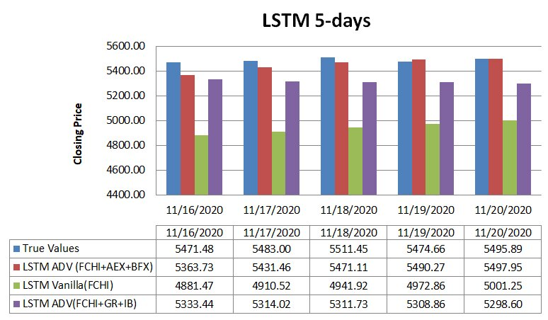

# Stock Market Prediction using Machine Learning

## Introduction
<p>

</p>

We built a ML model to predict France’s stock market, trained on France’s CAC40 dataset from Yahoo Finance! We implemented SVM for Portfolio Optimization for Trend Prediction, and developed LSTM-models fusing datasets to improve prediction & made a 7-day prediction.

## Objectives
1.  Firstly, a study on the various applications of Machine Learning in finance was provided. This would help to create a more general picture of how
Machine learning and finance are connected.
2.  Secondly, the work includes a study of the portfolio management problem as well as applying the SVM and neural network methods in the French stock
market.
3.  Thirdly, a study on the credit risk evaluation problem as well as ”overdraft” data. Also an applica.tion that takes into account all types of standard customer data.

## Overview of the Repository
In this repo, you'll find :
* `LSTM`: Code for LSTM Vanilla & advanced models in jupyter notebook
* `Data`: Dataset of France stock market 2020 from Yahoo Finance
* ` data_processing ` : Code for data pre-processing and feature engineering for SVM model for financial indicators
*  ` models ` : Code for SVM model weekly & monthly results, to invest or not
* `Reports` : Detailed documentation of our approach, software and results

## Getting Started
1.  Clone our repo: `git clone https://github.com/HusseinLezzaik/Stock-Market-Prediction.git`
2.  Install dependencies:
    ```
    conda create -n stock-market python=3.8
    conda activate stock-market
    pip install -r requirements.txt
    ```
3. Run `LSTM_METHOD.ipynb` for the method you want to make stock market prediction


## Collaborators
Hussein Lezzaik, Denis Demko, Thomas Deroo, Doris Fejza, Elona Karaj, Estia Maliqari, Yijue Xie.

## Acknowledgments
Our work was built on top of Haifei Zhang master thesis work at UTC-France, read more [here](https://github.com/Haifei-ZHANG/iQuant). 
